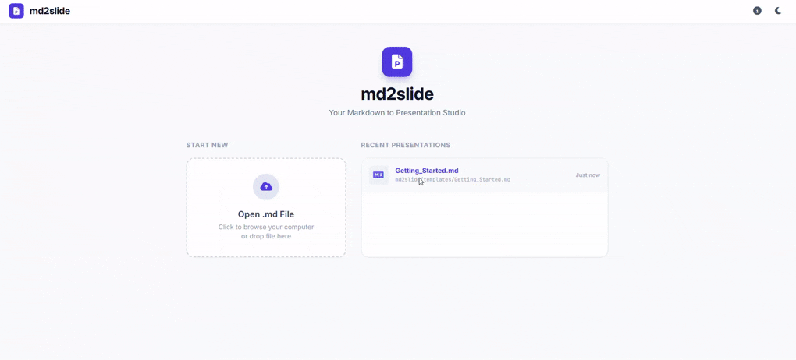

<h1 align="center">
  
  md2slides
</h1>

<p align="center">
  Transform Markdown into beautiful presentation slides.
</p>


`md2slide` is a lightweight CLI tool that transforms Markdown files into beautiful presentation slides.

Write your content in Markdown and instantly preview it as an interactive slide deck in the browser.

## Demo



## Features

* Markdown to presentation slides
* Fast local development server
* Live browser preview
* Simple CLI commands
* Lightweight and developer-friendly

## Installation

```bash
npm install -g md2slide
```

## Usage

Start the presentation server:

```bash
md2slides up
```

Open your browser and start presenting your Markdown slides instantly.

## Example

```md
# Welcome

This is your first slide.

---

# Second Slide

- Point one
- Point two
- Point three
```
